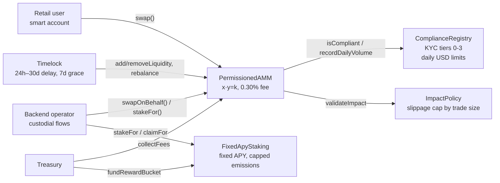

# Compliant AMM Contracts

Smart contracts for a **regulated retail token exchange on Base**: a permissioned constant-product AMM gated by on-chain KYC tiers, trade-size-aware slippage limits, a fixed-APY staking pool with hard emission guardrails, and a timelock over liquidity operations.

These are the contracts behind a production multi-currency token platform I built. It serves retail investors who never touch a seed phrase: the companion app ([compliant-token-exchange](https://github.com/yasinadil/compliant-token-exchange)) onboards them with ERC-4337 smart accounts and sponsored gas, and settles fiat through on- and off-ramp providers. This repository is a white-label build of that code.

---

## Architecture



| Contract | Responsibility |
|---|---|
| **PermissionedAMM** | Constant-product pool between a platform asset and a stablecoin. Phase machine (`UNINITIALIZED → SEED → ACTIVE → DEPRECATED`), 0.30% fee (max 5%), `MINIMUM_LIQUIDITY` floor. Two paths: **direct** `swap()` for verified wallets (KYC and daily volume enforced on-chain), and **custodial** `swapOnBehalf()` for the backend operator. Treasury can't trade. Liquidity changes go through the timelock. |
| **ComplianceRegistry** | KYC tiers set by compliance officers after off-chain verification. Per-tier daily USD limits ($10k / $100k / $1M by default, admin-configurable) that reset each UTC day. Only the AMM can record volume. |
| **ImpactPolicy** | Maximum slippage by trade notional: 3% under $1k, 2% under $10k, 1% under $100k, 0.5% above. Bands and caps are configurable, with monotonic caps enforced. |
| **FixedApyStaking** | Fixed-APY rewards via a reward-per-token accumulator. Hard guardrails: APY ≤ 50%, lock ≤ 1 year, an annual reward bucket, a **monthly emission cap** of bucket/12, and pool capacity derived as bucket / APY so promised yield is always fundable. Operator-delegated flows for custodial users. |
| **Timelock** | Queue, delay (24h–30d) and execute, with a 7-day grace period, cancellation and role separation (proposer / executor / canceller). |

---

## Security work

### Bug found and fixed: last staker could be locked out

While writing invariant tests for this showcase, the fuzzer found a rounding bug in `FixedApyStaking`:

- Each user's accrued reward is **floored once** over their whole holding period.
- The aggregate `totalAccruedUnpaid` was **floored once per global update**, which happens on every stake/claim by anyone or any admin parameter change.
- When a holding period spans several global updates, the user's single floor can exceed the sum of the aggregate's floors by a few wei.
- `emergencyWithdraw`, `unstake` and `claim` then executed `totalAccruedUnpaid -= x` and **reverted on underflow**, leaving the **last staker's principal stuck**. No admin function could repair the aggregate.

**Fix:** round the aggregate accrual **up** (`Math.mulDiv(..., Rounding.Ceil)`), which keeps `totalAccruedUnpaid ≥ Σ accruedRewards`. Covered by:

- `test_regression_lastStakerExitUnderflow`: the fuzzer's minimal counterexample (stake, global update after 1s, exit after 2,884s). It reverts on the pre-fix contract ([`test/legacy/`](test/legacy/)) and succeeds after the fix.
- Two fuzz tests at 10,000 runs.
- `invariant_everyStakerCanExit`: after any random sequence of stakes, unstakes, claims, APY changes and time warps (256 × 500 calls), every staker can withdraw their exact principal.

### Invariants

| Suite | Invariant |
|---|---|
| AMM | Book reserves equal token balances at all times (fees remain in reserves until collected) |
| AMM | No swap ever decreases `k` |
| AMM | Accrued fees are covered by reserves; reserves never fall below `MINIMUM_LIQUIDITY` |
| Staking | Contract balance always covers total staked principal |
| Staking | Every staker can always exit with their full principal |

### Design notes (trust model)

- `swapOnBehalf` trusts the operator: compliance and daily limits for custodial users are enforced off-chain. On-chain limits apply to the direct path.
- `setComplianceRegistry(address(0))` / `setImpactPolicy(address(0))` disable KYC gating and slippage checks immediately. That's useful for incident response, but in production these setters should sit behind the timelock or a multisig.
- `pause()` doesn't change `phase`; integrators should read `paused()`.

See [`docs/OPERATIONS.md`](docs/OPERATIONS.md) for roles, exit paths and incident response.

---

## Tests

```bash
git clone --recurse-submodules https://github.com/yasinadil/compliant-amm-contracts
cd compliant-amm-contracts
forge test
forge coverage --ir-minimum --no-match-coverage "(test|script|mocks)"
```

**133 tests:** unit, fuzz, regression, and 2 handler-based invariant suites (128,000 calls each).

| Contract | Lines | Functions |
|---|---|---|
| ComplianceRegistry | 100% | 100% |
| ImpactPolicy | 100% | 100% |
| PermissionedAMM | 97.1% | 100% |
| Timelock | 97.1% | 90.9% |
| FixedApyStaking | 95.3% | 97.1% |
| **Total** | **97.0%** | **97.8%** |

## Deploying

```bash
ASSET_TOKEN=0x... STABLE_TOKEN=0x... ADMIN=0x... TREASURY=0x... \
  forge script script/Deploy.s.sol --rpc-url $BASE_RPC_URL --account deployer --broadcast --verify
```

`script/AssignRoles.s.sol` hands operational roles to multisig, treasury and operator wallets (all addresses come from env).

## Stack

Solidity 0.8.27 · Foundry (unit, fuzz, invariant) · OpenZeppelin 5.4 (AccessControl, Ownable2Step, Pausable, ReentrancyGuard, SafeERC20, Math) · Base
